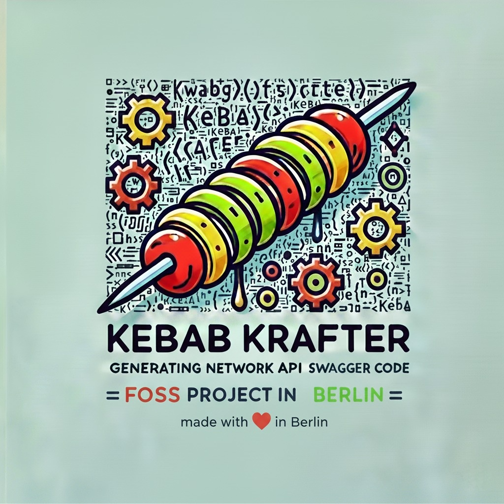

<p align="center">
  <a href="docs/kebab-krafter-v2.1.png" rel="noopener">
    </a>
</p>

<h3 align="center">Kebab Krafter</h3>
<h6 align="center">FOSS made with ❤️ in Berlin</h6>

<p align="center"> Generates all the boring network API code from a Swagger spec.
    <br>
</p>
<p>
Available for:
    <br> - Ktor Server
    <br> - Ktor Client (soon) 
    <br> - Swift client (hopefully)
</p>

---

## About

Kebab-Krafter is a gradle plugin to auto-generate network interfaces from a set of swagger API documentation.

## Getting Started <a name = "getting_started"></a>

To start using the plugin just add to your `build.gradle.kts` file:

```kotlin
id("com.diconium.mobile.tools.kebab-krafter") version "latest_version"
```

### Generate Ktor Server

Just add the configuration to your gradle script

```kotlin

ktorServer {

	// Root package name for the generated code
	packageName = "root.package.name.for.the.generated.code"

	// file system location for the swagger spec
	specFile = File(rootDir, "swagger/api.yml")

	// definition for the receiver class for the API controllers
	contextSpec {
		packageName = "com.myserver.api"
		className = "CallScope"
		factoryName = "from"
	}
}
```

and with that you can execute `./gradlew generateKtorServer` to auto-genearted a `Route.installGeneratedRoutes`, all the `data classes` using `kotlinx-serialization` and the interfaces for each endpoint in the following format:

```Kotlin
public interface GetPathName {
    public fun CallScope.execute(pathParameters, queryParameters, body) : ResponseBody
}
```

From that you just have to implement the interfaces!

#### The contextSpec

The `contextSpec` is a "joker-card" to extract any metadata needed from the `Ktor.ApplicationCall` before passing to the controller. In the sample app you can see it extracting the `accept-language` header into a `Locale` object.

In the snippet above the context was named `CallScope` in the package `com.myserver.api`, a simple example for it would be:

```Kotlin
interface CallScope {
    val locale: Locale // define meta-data your controller needs from the request

    companion object {

        // define a factory function to create the object
        fun from(call: ApplicationCall): CallScope = CallScopeImpl(call)
    }
}
```

Making this context an interface is advisable, so that it's trivial to unit test the controller by creating a `FakeContext()`

```Kotlin
// implement the real object separetely, to make it trivial to implement unit tests.
private class CallScopeImpl(private val call: ApplicationCall) : CallScope {
    override val locale: Locale by lazy {
        call.request.acceptLanguage().toLocale()
    }
}
```

#### The ServiceLocator

The generated `installGeneratedRoutes` receives a object of type `ServiceLocator` located in the same package of the `installGeneratedRoutes`.

The `ServiceLocator` is a very simple `get<T>` interface that can be adapted to any dependency injection you want to use. For example using Koin it would be something like:

```kotlin
class KoinServiceLocator(private val koin: Koin) : ServiceLocator {
	override fun <T : Any> getService(type: KClass<T>): T = koin.get(type)
}
```

### Further Examples

Check the `sample/` app with the "Pet Store" for a full example.


## Plugin Development notes

### Setup

The most practical way is to open on IntelliJ the sample app. The `sample/settings.gradle` points to the source code of the plugin and applies it to the project.

After gradle import/index the source code from the plugin will be linked and display on the IDE and it's trivial to do the changes on the plugin and see the effects on the sample. 

### Disable task caching/auto execution

It might become necessary during the plugin development to disable the task caching and auto-execution.

For that:
- In `KtorServerExtension.kt` comment out `OutputDirectory` and `Optional` from `outputFolder` and add `@get:Console`
- In `ApplyGenerateKtorServer.kt` and replace in both `sourceSet.<type>.srcDirs(task)` to `sourceSet.<type>.srcDirs(target.defaultOutput)`.

This way you can control when the code is generated, but it will still be linked to the `sourceSet`

## Authors <a name = "authors"></a>

- [@rvp-diconium](https://github.com/rvp-diconium)

See also the list of [contributors](https://github.com/diconium/kebab-krafter/contributors) who participated in
this project.
