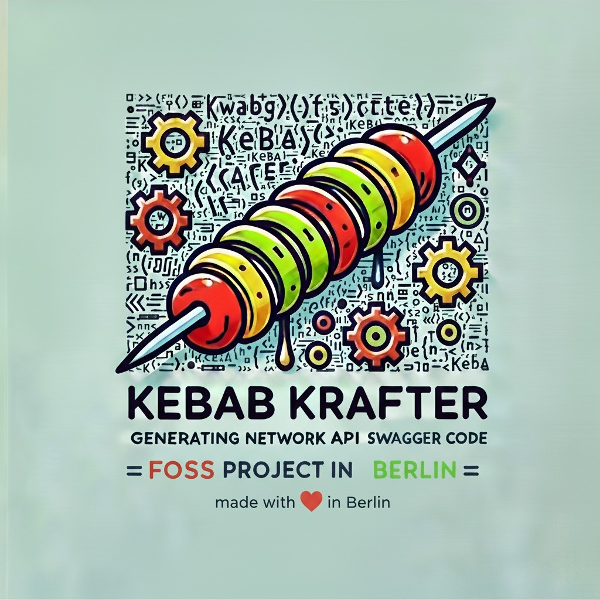

<p align="center">
  <a href="docs/kebab-krafter-v2.1.png" rel="noopener">
    </a>
</p>

<h3 align="center">Kebab Krafter</h3>
<h6 align="center">FOSS made with ❤️ in Berlin</h6>

<p align="center"> Generates all the boring network API code from a Swagger spec.
    <br>
</p>
<p>
Available for:
    <br> - Ktor Server
    <br> - Ktor Client (JVM and Android)
    <br> - Kotlin Multiplatform (in analyze)
    <br> - Swift client (hopefully)
</p>

---

## About

Kebab-Krafter is a gradle plugin to auto-generate network code from a set of swagger API documentation.

### Why another generator?

Mainly 3 reasons:

#### Ktor native

This is a Ktor specific solution, build on modern kotlin using Result, coroutines and serialization

#### Supports Polymorphism

Supports `oneOf` and `anyOf` fields from Json Schema and generates appropriate Kotlin `sealed class` and using [Kotlinx.serialization Polymorphism](https://github.com/Kotlin/kotlinx.serialization/blob/master/docs/json.md#class-discriminator-for-polymorphism)

#### Streamlined Gradle plugin

The swagger yml and Json schemas are commited into git repository and are the source of truth. The generated code is part of the `build/` folder and is re-created automatically as needed.

## Getting Started <a name = "getting_started"></a>

To start using the plugin just add to your `build.gradle.kts` file:

```kotlin
id("io.github.budius.kebab-krafter") version "latest_version"
```

### Generate Ktor Server

Simply add one (or more) server configuration to your gradle script

```kotlin

ktorServer {

	create("main") {
		// Root package name for the generated code
		packageName = "root.package.name.for.the.generated.code"

		// file system location for the swagger spec
		specFile = File(rootDir, "swagger/api.yml")
		schemasFolder = File(rootDir, "swagger/models/")

		// definition for the receiver class for the API controllers
		contextSpec {
			packageName = "com.myserver.api"
			className = "CallScope"
			factoryName = "from"
		}
	}
}
```

and with that you can execute `./gradlew generateKtorServer` (automatically rebuild on changes). This generates:
- `Route.installMainGeneratedRoutes` function
- All the `data classes` using `kotlinx-serialization` 
- Appropriate interfaces for all endpoints following the format as in the example below:

```Kotlin
public interface GetPathName {
    public fun CallScope.execute(pathParameters, queryParameters, body) : ResponseBody
}
```

From that you just have to implement the interfaces!

#### The contextSpec

The `contextSpec` allows to extract metadata (e.g.: headers) needed from the `Ktor.ApplicationCall` before passing it to the controller. In the sample app you can see it extracting the `accept-language` header into a `Locale` object.

In the snippet above the context was named `CallScope` in the package `com.myserver.api`, a simple example for it would be:

```Kotlin
interface CallScope {
    val locale: Locale // define meta-data your controller needs from the request

    companion object {

        // define a factory function to create the object
        fun from(call: ApplicationCall): CallScope = CallScopeImpl(call)
    }
}

private class CallScopeImpl(private val call: ApplicationCall) : CallScope {
	override val locale: Locale by lazy {
		call.request.acceptLanguage().toLocale()
	}
}
```

For tests a `FakeContext()` can be created for easy unit testing.

#### The ServiceLocator

The generated `install<CamelCaseName>GeneratedRoutes` receives an object of type `ServiceLocator` located in `com.budius.kebabkrafter` package.

The `ServiceLocator` is a very simple `get<T>` interface that can be adapted to any dependency injection you want to use. For example using Koin it would be something like:

```kotlin
class KoinServiceLocator(private val koin: Koin) : ServiceLocator {
	override fun <T : Any> getService(type: KClass<T>): T = koin.get(type)
}
```

### Further Examples

Check the `sample/` app with the "Pet Store" for a full example.

### Generate a Ktor Client

Similar to the server, it's just a simple gradle configuration:

```kotlin
ktorClient {
	create("petStore") {
		packageName = "root.package.name.for.the.generated.code"
		specFile = File(rootDir, "swagger/api.yml")
		schemasFolder = File(rootDir, "swagger/models/")
	}
}
```

and the task `./gradlew generateKtorClient` (automatically rebuild on changes) will be available and generate:

- A `fun interface` for each endpoint 
- An extension function on `HttpClient` for this functional interface.

An example functional interface from the "Pet shop" sample:
```kotlin
fun interface GetPetId { suspend fun invoke(id) : Result<GetPetIdResponse> }
```
and this can be used in code in two ways, either by directly calling the extension function:
```kotlin
// assume `client: HttpClient` configured with baseUrl and auth-headers
// direct usage
val result = client.getPetId("123")
```
or getting an instance of the interface that you can pass to a dependency injection or ViewModel
```kotlin
val getPetId: GetPetId = client.getPetId
val result = getPetId("123")
```
## Plugin Development notes

### Setup

The most practical way is to open on IntelliJ the sample app. The `sample/settings.gradle` points to the source code of the plugin and applies it to the project.

After gradle import/index the source code from the plugin will be linked and display on the IDE and it's trivial to do the changes on the plugin and see the effects on the sample.

## Authors <a name = "authors"></a>

- [@budius](https://github.com/budius)
